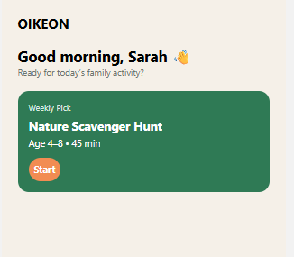
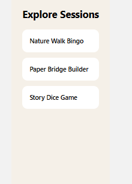
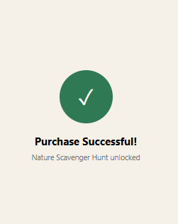

# OIKEON – Cross-Platform Mobile App (Assignment 3)

## Project Overview

**OIKEON** is a family-centered mobile learning application designed to support structured parent-child interaction through guided activities.

This project is part of the **Cross-Platform Mobile Development (React Native)** coursework and focuses on transforming a high-fidelity Figma design into reusable, modular UI components.

---

## Objective

The goal of this assignment is to:

- Analyze an existing UI design (from Figma)
- Extract reusable interface components
- Implement them using **React Native**
- Ensure modularity, adaptability, and clean architecture

---

## Key Components Implemented

The following reusable components were built:

### 🔹 UI Components

- `AppHeader` – top navigation with title and optional actions
- `PrimaryButton` – main CTA button
- `SecondaryButton` – secondary action button
- `SessionCard` – main content card (session preview)
- `StatCard` – compact info card (progress, stats)
- `CategoryChip` – filter/tag element
- `SearchBar` – search input field
- `BottomTabBar` – navigation bar

---

## Screens

The app includes the following screens based on Figma design:

- **Home Screen**
- **Sessions Screen**
- **Profile Screen**
- **Cart / Checkout Screen**
- **Confirmation Screen**

---

## Project Structure

```bash
src
├── app
│   ├── index.tsx
│   └── _layout.tsx
├── components
│   ├── AppHeader.jsx
│   ├── PrimaryButton.jsx
│   ├── SecondaryButton.jsx
│   ├── SessionCard.jsx
│   ├── CategoryChip.jsx
│   ├── SearchBar.jsx
│   ├── StatCard.jsx
│   └── BottomTabBar.jsx
├── constants
│   ├── colors.js
│   ├── spacing.js
│   └── mockData.js
└── screens
    ├── HomeScreen.jsx
    ├── SessionsScreen.jsx
    ├── ProfileScreen.jsx
    ├── CartScreen.jsx
    └── ConfirmationScreen.jsx
```

---

## Design Reference

Figma design used for implementation: [https://www.figma.com/design/o9qocO9U1JkG19v1BLuIGk/OIKEON-%E2%80%93-High-Fidelity-UI-Screens](https://www.figma.com/design/o9qocO9U1JkG19v1BLuIGk/OIKEON-%E2%80%93-High-Fidelity-UI-Screens)

---

## Screenshots

### Home Screen



### Sessions Screen



### Profile Screen


### Confirmation Screen



---

## Design Decisions

- **Component-based architecture** ensures reusability and scalability
- **Centralized constants** (`colors`, `spacing`) avoid magic numbers
- **Props-driven components** allow dynamic rendering
- **Flat structure** improves maintainability and clarity
- **Mobile-first layout** with optional width constraint for web preview

---

## Responsiveness

- Layout adapts using:
  - `flexbox`
  - `useWindowDimensions`

- Works in:
  - portrait mode
  - landscape mode

- Web preview constrained to mobile width for realistic UI

---

## Code Quality

- Modular structure (each component in separate file)
- Reusable styling via constants
- Clear naming conventions
- Minimal duplication
- Clean imports and separation of concerns

---

## How to Run

```bash
npm install
npm start
```

Then:

- press `w` → open in browser
- or scan QR with Expo Go

---

## Assignment Requirements Coverage

✔ Component-based architecture
✔ Use of React Native core components (`View`, `Text`, `ScrollView`, etc.)
✔ Styling via `StyleSheet.create()`
✔ Responsive layout
✔ Props usage
✔ Clean project structure
✔ Screens implemented based on Figma
✔ Git repository with screenshots

---

## 💡 Future Improvements

- Navigation between screens
- State management (Context / Redux)
- Backend integration (API)
- User authentication
- Progress tracking system

---
