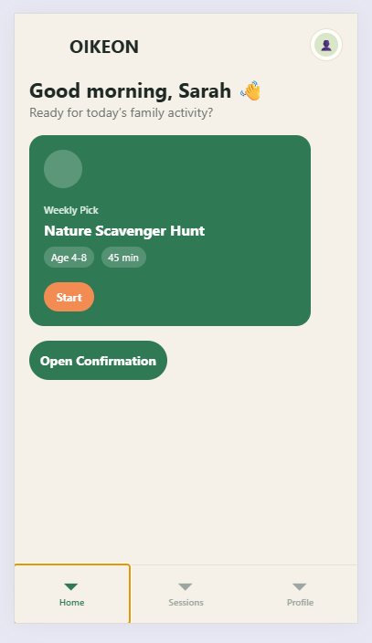

# OIKEON — Cross Assignment 4

## Project Overview

OIKEON is a family-centered mobile learning application.  
In this assignment, navigation was implemented in React Native based on the previously designed interface.

## Navigation Structure

The project uses:

- **Tab Navigation** for the main app sections:
  - Home
  - Sessions
  - Profile

- **Stack Navigation** for linear transitions:
  - Home → Confirmation
  - Sessions → Session Details

## Data Passing Between Screens

Navigation parameters are passed with `navigation.navigate()`.

Examples used in the project:

- `sessionId`
- `sessionTitle`
- `title`
- `age`
- `duration`

The destination screens read these values through `route.params`.

## Styling

Navigation elements were styled to match the OIKEON interface:

- soft background colors
- custom header appearance
- styled tabs
- consistent spacing and typography

## Project Structure

```bash
src
├── app
│   ├── _layout.tsx
│   └── index.tsx
├── components
├── constants
├── navigation
│   ├── AppNavigator.js
│   ├── HomeStack.js
│   ├── SessionsStack.js
│   └── TabsNavigator.js
└── screens
    ├── ConfirmationScreen.jsx
    ├── HomeScreen.jsx
    ├── ProfileScreen.jsx
    ├── SessionDetailsScreen.jsx
    └── SessionsScreen.jsx
```

## Screenshots

### Home Screen



### Confirmation Screen


### Sessions Screen


### Session Details Screen


### Profile Screen


## How to Run

```bash
npm install
npx expo start -c
```

Then press `w` to open in browser or use Expo Go on a mobile device.

## Technologies Used

- React Native
- Expo
- Expo Router
- React Navigation
- Native Stack Navigator
- Bottom Tabs Navigator

## Assignment Requirements Covered

- navigation structure designed and implemented
- Stack and Tab navigation used
- data passed between screens
- route parameters handled safely
- navigation placed in separate files
- navigation elements styled
- screenshots added to README
